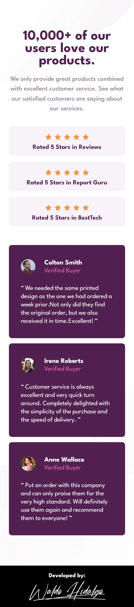
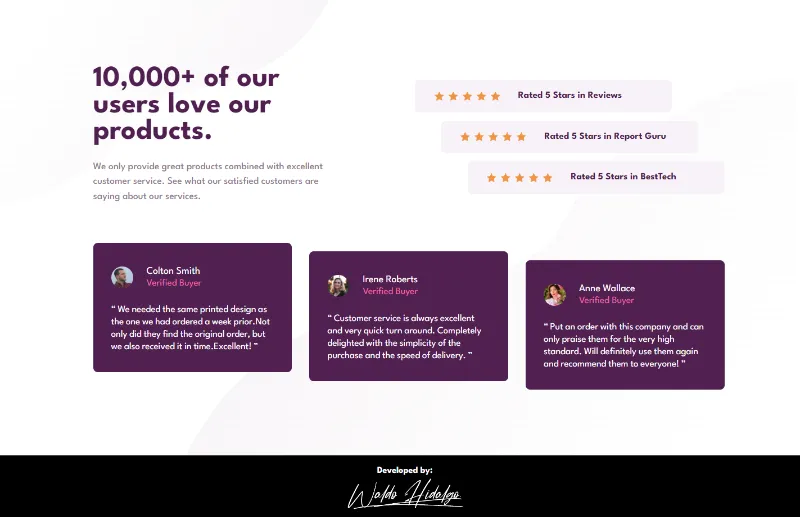

# Social proof section

Repositorio con el código solución del challenge: [Social proof section challenge on Frontend Mentor](https://www.frontendmentor.io/challenges/social-proof-section-6e0qTv_bA)

## Tabla de Contenidos

- [Social proof section](#social-proof-section)
  - [Tabla de Contenidos](#tabla-de-contenidos)
  - [The challenge](#the-challenge)
  - [Diseños a Replicar](#diseños-a-replicar)
    - [1-Mobile Design](#1-mobile-design)
    - [2-Desktop Design](#2-desktop-design)
  - [Proyecto Realizado](#proyecto-realizado)
    - [1-Project on Mobile Screen](#1-project-on-mobile-screen)
    - [2-Project on Desktop Screen](#2-project-on-desktop-screen)
  - [Modificaciones](#modificaciones)
    - [Se cambia componente de React que muestra background Images a componente de TailwindCSS](#se-cambia-componente-de-react-que-muestra-background-images-a-componente-de-tailwindcss)

## The challenge

El challenge consiste en realizar lo siguiente:

> Users should be able to:
>
> - View the optimal layout for the section depending on their device's screen size

## Diseños a Replicar

### 1-Mobile Design


### 2-Desktop Design


## Proyecto Realizado

### 1-Project on Mobile Screen



### 2-Project on Desktop Screen



## Modificaciones

### Se cambia componente de React que muestra background Images a componente de TailwindCSS

Se cambia el siguiente componente de React:

```jsx
import bgPatternTopMobile from "../assets/bg-pattern-top-mobile.svg";
import bgPatternBottomMobile from "../assets/bg-pattern-bottom-mobile.svg";

import bgPatternTopDesktop from "../assets/bg-pattern-top-desktop.svg";
import bgPatternBottomDesktop from "../assets/bg-pattern-bottom-desktop.svg";

export default function BackgroundsPatterns() {
  return (
    <>
      
      

      
      
    </>
  );
}
```

Al siguiente componente de TailwindCSS:

```css
.backgroundLayer {
  background: url("./assets/bg-pattern-top-mobile.svg") top left/100% auto
      no-repeat, url("./assets/bg-pattern-bottom-mobile.svg") bottom right/100%
      50% no-repeat;
}
@screen md {
  .backgroundLayer {
    background: url("./assets/bg-pattern-top-desktop.svg") top left no-repeat, url("./assets/bg-pattern-bottom-desktop.svg")
        bottom right no-repeat;
  }
}
```
