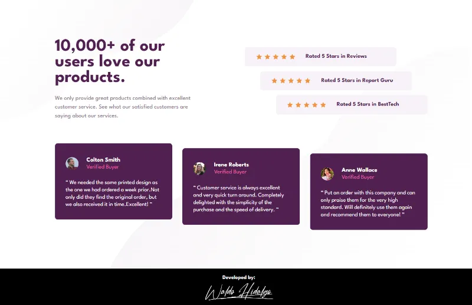

# Social proof section

Repositorio con el código solución del challenge: [Social proof section challenge on Frontend Mentor](https://www.frontendmentor.io/challenges/social-proof-section-6e0qTv_bA)

## Tabla de Contenidos

- [Social proof section](#social-proof-section)
  - [Tabla de Contenidos](#tabla-de-contenidos)
  - [The challenge](#the-challenge)
  - [Diseños a Replicar](#diseños-a-replicar)
    - [1-Mobile Design](#1-mobile-design)
    - [2-Desktop Design](#2-desktop-design)
  - [Proyecto Realizado](#proyecto-realizado)
    - [1-Project on Mobile Screen](#1-project-on-mobile-screen)
    - [2-Project on Desktop Screen](#2-project-on-desktop-screen)

## The challenge

El challenge consiste en realizar lo siguiente:

> Users should be able to:
>
> - View the optimal layout for the section depending on their device's screen size

## Diseños a Replicar

### 1-Mobile Design

### 2-Desktop Design

## Proyecto Realizado

### 1-Project on Mobile Screen

### 2-Project on Desktop Screen

